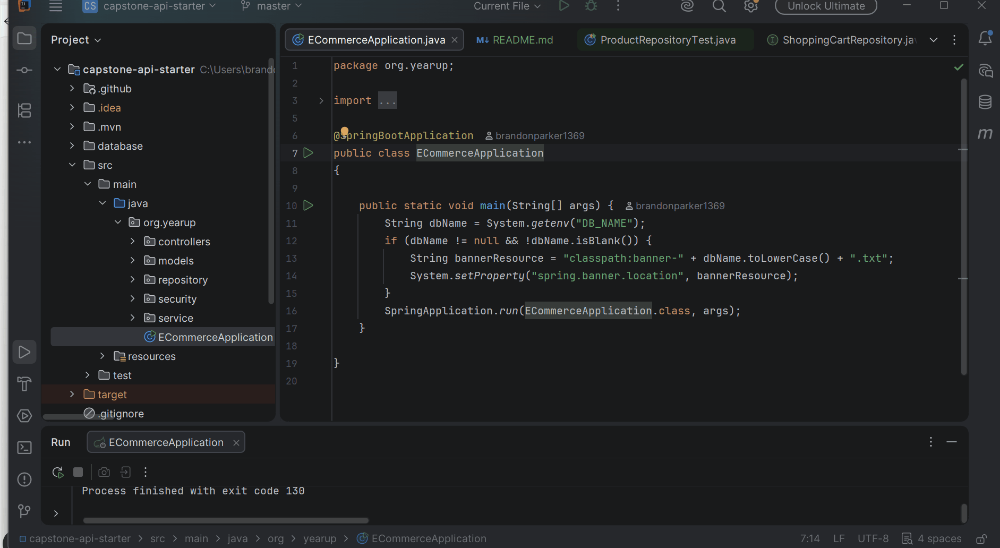

# Capstone 3 - Record Store API

## Description of the Project
This is a backend REST API for an online record store built with Java and Spring Boot.
It allows customers to browse vinyl records and music equipment by category, search and
filter products, and manage a shopping cart. Admins can manage categories and products.
The intended users are music lovers who want to shop online for records and audio equipment.

## User Stories
- As a customer, I want to see all categories so I can browse the store by type.
- As a customer, I want to look up a specific category by ID so I can see its details.
- As a customer, I want to see all products in a category so I can find what I'm looking for.
- As an admin, I want to add new categories so I can keep the store organized.
- As an admin, I want to edit a category so I can fix mistakes or update information.
- As an admin, I want to delete a category that is no longer needed.
- As a logged in user, I want to view my shopping cart so I know what I'm about to buy.
- As a logged in user, I want to add products to my cart so I can buy them later.
- As a logged in user, I want to clear my cart so I can start fresh.

## Setup

### Prerequisites
- IntelliJ IDEA: Download from [here](https://www.jetbrains.com/idea/download/)
- Java SDK 17
- MySQL Workbench

### Running the Application in IntelliJ
1. Open IntelliJ IDEA
2. Select "Open" and navigate to the project directory
3. Open MySQL Workbench and run the `create_database_recordshop.sql` script
4. Update `application.properties` with your MySQL username and password
5. Find `ECommerceApplication.java` and click the green Run button

### Demo Users
- Username: `user` Password: `password`
- Username: `admin` Password: `password`

## Technologies Used
- Java 17
- Spring Boot
- Spring Security with JWT Authentication
- Spring Data JPA
- MySQL
- Insomnia (API testing)

## Demo

## Future Work
- Finish Phase 4 & 5 
- Add order history so users can view past purchases
- Add product reviews and ratings
- Improve search functionality with more filter options

## Resources
- Raymond's Notes
- https://www.w3schools.com/java/
- https://www.javaspring.net/blog/rest-api-web-services-in-java/

## Team Members
- **Brandon Parker** - Sole developer, implemented all features

## Thanks
- Thank you to my YearUp instructors for their guidance and support throughout this project